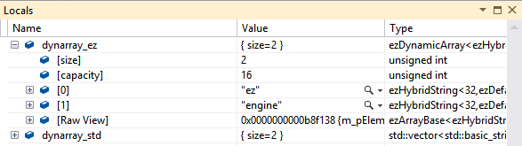

VS2012 debugger variable inspection using natvis {#DebuggerVarInsp}
===============

About natvis
---------------
By default it is very tiresome to view the actual content of some base types like ezDynamicArray or ezString because the interesting values are often hidden in multiple abstraction layer and pointer indirections. In Visual Studio 2012 you can use the provided *.natvis file to display most of ezEngine's string and containter types like their equivalent in the standard library.

How to Use
---------------
ezEngine comes with a *.natvis file for Visual Studio 2012. You can find the file under ["Code/Utilities/Visual Studio Visualizer/ezEngine.natvis"](../../../Code/Utilities/Visual Studio Visualizer/ezEngine.natvis)
- Copy _ezEngine.natvis_ to "%USERPROFILE%/My Documents/Visual Studio 2012/Visualizers/"
- Have a fun debug session! No restart of Visual Studio needed!

Supported Types
---------------
Some of them are implicit by parent types, more types could be affected.
"Alias" means that the file handles this type explicitly, but has it noted as alternative name for the type listed above 

**Strings**
- ezHybridStringBase
    - ezStringBuilder (alias)  
    - ezString
    - ezHybridString
- ezStringView
- ezHashedString

**Containers**
- ezArrayBase
    - ezDynamicArray
    - ezDynamicArrayBase
    - ezStaticArray
- ezHashTableBase (partial due to natvis limitations)
    - ezHashTable
- ezListBase
    - ezList
- ezDequeBase
    - ezDeque
- ezMapBase
    - ezSet (alias)  
    - ezMap
- ezStaticRingBuffer (wrong element order)
- ezArrayPtr

**Basic Types**
- ezVariant
- ezEnum
- ezBitflags
- ezVec2Template
    - ezVec2
    - ezVec2d
- ezVec3Template
    - ezVec3
    - ezVec3d
- ezVec4Template
    - ezVec4
    - ezVec4d
- ezQuatTemplate
    - ezQuat
    - ezQuatd
- ezPlaneTemplate
    - ezPlane
    - ezPlaned
- ezMat3Template
    - ezMat3
    - ezMat3d
- ezMat4Template
    - ezMat4
    - ezMat4d
- ezColor
- ezTime

natvis_samplecode.cpp
---------------
["Code/Utilities/Visual Studio Visualizer/natvis_samplecode.cpp"](../../../Code/Utilities/Visual Studio Visualizer/natvis_samplecode.cpp) contains also a sample code that compares debug display of ez-classes with equivalent classes of the C++ standard library.

Extending/writing natvis definitions
---------------
You can find more informations about VS12 natvis files in the MSDN: [Creating custom views of native objects in the debugger](http://msdn.microsoft.com/en-us/library/vstudio/jj620914.aspx)